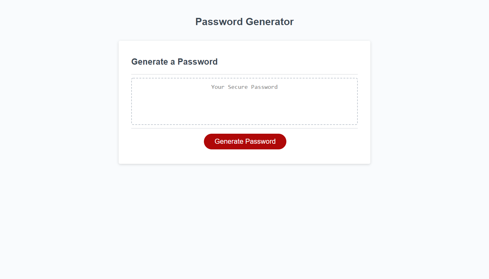

# password_generator

**Note:** This repo contains my source code for a configurable, randomized password generator created for Challenge 3 of GA Tech's 2022 Coding Bootcamp.

## Randomized Password Generator ##

A secure, high entropy password is essential for online privacy, security, and safety. In aims of that goal, this application is a randomized password generator that takes a variety of parameters from the user and generates a high entropy password based on that criteria. 

It accepts a desired length ranging from 8 to 128 characters as well as parameters that determine whether the user wants upper case, lower case, numerical, or special characters included in the generated password. It can be easily modified to increase the available options or functionality.

## Live Website ##

https://chromodyne.github.io/password_generator/

## Screenshot ##

